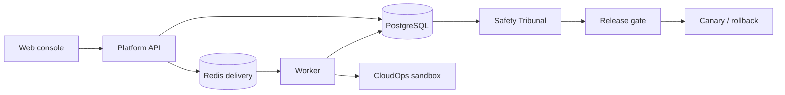

# AgentRail

An internal developer platform for treating an AI agent as a versioned, testable, observable and
deployable software artefact.

The question AgentRail exists to answer:

> How can a team prove that an agent change is safer, more reliable and more useful **before**
> exposing it to users?

> [!NOTE] > **Status: the final-completion build is in progress.** The repository now contains the deterministic
> request path, authentication and tenancy, CloudOps sandbox, agent registry, validated datasets,
> frozen suites, durable evaluation execution, redacted trajectories, replay, fault injection,
> policy approvals, release gates, canary records, run-level observability metrics, deterministic and
> model-backed Tribunal scaffolding, container security checks, frozen benchmark artifacts, GHCR
> release packaging, Helm deployment templates and AWS OIDC/Terraform scaffolding. A public URL and
> live cloud smoke verification still require owner cloud credentials.

---

## What works today

**Sign in, create an organisation, run a deterministic job, register agent versions, build validated
dataset/suite records, execute a frozen suite as a durable evaluation run, inspect redacted
per-item trajectories, create safe replay records from checkpoints, run a deterministic six-role
Safety Tribunal over run/comparison evidence, and read reproducible comparison summaries,
release-gate verdicts and canary deployment history inside one of its projects.**
Operators can fetch a run metrics snapshot with correlation and trace identifiers, queue/retry
health, budget spend, release and canary status, and the SLO verdict.

Authentication is delegated and pluggable: local development, CI and the demo use a deterministic
provider that needs no credentials at all, while deployed environments use GitHub OAuth. Sessions are
opaque server-side rows revoked on sign-out; API keys for CI are stored only as hashes and bounded by
both a role and optional scopes.

Every tenant-owned row belongs to an organisation, and one function decides every access question —
including that another tenant's resource returns `403`, never `404`, so identifiers cannot be
enumerated.

Underneath that, the deterministic vertical slice from Phase 0:

```text
Web console  ──POST /api/v1/jobs──▶  Platform API  ──row──▶  PostgreSQL   (authoritative)
                                          │
                                          └──job id──▶  Redis  ──▶  Worker
                                                                      │
                                                        CloudOps sandbox (deterministic)
                                                                      │
      Web console  ◀──poll GET /api/v1/jobs/{id}──  PostgreSQL  ◀──result
```

Every hop carries a correlation id and a W3C `traceparent`. The result is a SHA-256 digest of the
submitted message, so a reviewer can verify the payload survived all five hops unmodified. No model
provider is involved, so the path is byte-for-byte reproducible and costs nothing to run.



| Component         | Path                        | What it does                                                 |
| ----------------- | --------------------------- | ------------------------------------------------------------ |
| Web console       | `apps/web`                  | Next.js 15 + React 19, strict TypeScript, TanStack Query     |
| Platform API      | `services/api`              | FastAPI, SQLAlchemy 2, Alembic, idempotent job creation      |
| Worker            | `services/worker`           | Redis consumer, conditional-update claims, graceful shutdown |
| CloudOps sandbox  | `services/cloudops-sandbox` | Synthetic, deterministic tool surface                        |
| Shared primitives | `packages/core-py`          | Settings, JSON logging, correlation, job state machine       |
| Contracts         | `packages/contracts`        | OpenAPI snapshot and generated TypeScript types              |

---

## Benchmark evidence

Frozen deterministic benchmark artifacts are generated by `scripts/benchmark.py` and summarized in
[`docs/benchmarks/RESUME_METRICS.md`](docs/benchmarks/RESUME_METRICS.md).

| Benchmark | Scenarios | Task success | Tribunal consensus | Gate precision | Gate recall |
| --------- | --------: | -----------: | -----------------: | -------------: | ----------: |
| smoke     |        32 |        0.938 |              0.875 |          0.571 |       0.800 |
| quality   |       320 |        0.903 |              0.922 |          0.703 |       0.945 |
| failures  |       160 |        0.794 |              0.906 |          0.760 |       0.927 |
| tribunal  |       128 |        0.859 |              0.977 |          0.903 |       1.000 |
| load      |        96 |        0.854 |              0.917 |          0.760 |       0.905 |

```bash
make benchmark-report
```

Each metric links back to raw JSON rows with scenario ids, runtime metadata, confidence intervals,
per-family confusion matrices and version fingerprints.

---

## Quick start

Requirements: Docker, Node 22.12+, [pnpm](https://pnpm.io) 9, [uv](https://docs.astral.sh/uv/), and
GNU Make.

```bash
make bootstrap        # install toolchains, create .env from .env.example
make compose-up       # PostgreSQL, Redis, MinIO
make migrate          # apply database migrations
make verify           # formatting, lint, strict types, unit tests, contract drift
```

Run the whole stack in containers and open the console at <http://localhost:3737>:

```bash
make compose-up-apps  # sandbox, migrations, API and worker
pnpm --filter @agentrail/web dev
```

Or run the services from source on the host:

```bash
make dev              # sandbox + API + worker + web, all in the foreground
```

### Verifying the path by hand

```bash
# Sign in (deterministic provider — any email works, no password)
curl -s -c cookies.txt -X POST localhost:8000/api/v1/auth/dev/session \
  -H 'content-type: application/json' -d '{"email":"ada@example.com"}'

# Create an organisation; a default project comes with it
ORG=$(curl -s -b cookies.txt -X POST localhost:8000/api/v1/organisations \
  -H 'content-type: application/json' -d '{"name":"Ada Labs"}' | jq -r .id)
PROJECT=$(curl -s -b cookies.txt localhost:8000/api/v1/organisations/$ORG/projects | jq -r .items[0].id)

# Run a job in it
curl -s -b cookies.txt -X POST localhost:8000/api/v1/projects/$PROJECT/jobs \
  -H 'content-type: application/json' -H 'Idempotency-Key: demo-1' \
  -d '{"message":"phase one"}'
```

Without the cookie, every one of those calls returns `401`.

Replaying the same idempotency key returns `200` with the original job rather than creating a
second one. Replaying it with a _different_ body returns `409 idempotency_key_reused`.

---

## Commands

| Command                                                | Purpose                                                                                    |
| ------------------------------------------------------ | ------------------------------------------------------------------------------------------ |
| `make bootstrap`                                       | Install every toolchain dependency and create `.env`                                       |
| `make verify`                                          | Everything CI runs that needs no services: format, lint, types, unit tests, contract drift |
| `make test`                                            | Unit tests only (integration tests skip when dependencies are absent)                      |
| `make integration`                                     | Tests against real PostgreSQL and Redis                                                    |
| `make e2e`                                             | Playwright tests against a running stack                                                   |
| `make contracts`                                       | Regenerate the OpenAPI snapshot and the TypeScript client                                  |
| `make benchmark-report`                                | Generate frozen benchmark artifacts and resume metrics                                     |
| `make migrate`                                         | Apply database migrations                                                                  |
| `make compose-up` / `compose-up-apps` / `compose-down` | Manage the local stack                                                                     |
| `make build`                                           | Build the web app and Python distributions                                                 |
| `make clean`                                           | Remove build outputs, caches and local volumes                                             |

`make help` lists them all.

---

## Design commitments

These hold from Phase 0 onward and are enforced by tests, not by convention:

- **PostgreSQL is authoritative.** Redis carries delivery only. A job row is committed _before_ its
  identifier is published, evaluation runs use the same durable-outbox pattern, and losing Redis
  delays work rather than losing it.
- **Retries are safe.** Delivery is at-least-once. Every state change is a conditional
  `UPDATE ... WHERE state = <expected>`, so duplicate delivery, racing workers and late events
  cannot cause a second execution. Evaluation run items are leased with retry budgets and PostgreSQL
  checkpoints. Terminal states have no outgoing transitions at all.
- **Errors are a contract.** Every non-2xx response is a `ProblemDetail` with a stable machine-readable
  `code` and a `correlation_id`. Stack traces never reach a client.
- **Secrets stay out of diagnostic payloads.** The JSON log formatter redacts any field whose key
  looks sensitive before serialisation, and trajectory capture recursively redacts sensitive keys and
  email addresses before persistence.
- **The demo needs no paid key.** The deterministic path is the default, not a fallback — including
  sign-in, which is why the entire test suite runs without an OAuth application configured.
- **One function decides access.** `authorize(principal, permission, organisation_id=...)` is pure
  and exhaustively tested. Tenancy is checked before permission, and both failures are
  indistinguishable from the outside, so the API is not an enumeration oracle.
- **Credentials are never stored in a replayable form.** Sessions and API keys are persisted only as
  one-way digests, and comparison is constant-time.
- **Authenticated callers have a request budget.** The API enforces a Redis-backed fixed-window
  rate limit per user or API key. Redis is only the short-lived counter store; durable state remains
  in PostgreSQL.

---

## Documentation

| Document                                                                           | Contents                                      |
| ---------------------------------------------------------------------------------- | --------------------------------------------- |
| [`docs/architecture/OVERVIEW.md`](docs/architecture/OVERVIEW.md)                   | Services, data flow, boundaries               |
| [`docs/architecture/ER_DIAGRAM.md`](docs/architecture/ER_DIAGRAM.md)               | Storage model and relationships               |
| [`docs/PRODUCT_REQUIREMENTS.md`](docs/PRODUCT_REQUIREMENTS.md)                     | Product promise and v1 workflows              |
| [`docs/api/OPENAPI.md`](docs/api/OPENAPI.md)                                       | Generated API contract guidance               |
| [`docs/evaluation/METHODOLOGY.md`](docs/evaluation/METHODOLOGY.md)                 | Evaluation and benchmark methodology          |
| [`docs/tribunal/PROMPT_VERSIONING.md`](docs/tribunal/PROMPT_VERSIONING.md)         | Tribunal roles and prompt-version contract    |
| [`docs/TEST_STRATEGY.md`](docs/TEST_STRATEGY.md)                                   | Test layers and invariants                    |
| [`docs/adr/`](docs/adr/)                                                           | Architecture decision records                 |
| [`docs/security/THREAT_MODEL.md`](docs/security/THREAT_MODEL.md)                   | Trust boundaries and mitigations              |
| [`docs/security/RETENTION_POLICY.md`](docs/security/RETENTION_POLICY.md)           | Evidence and audit retention defaults         |
| [`docs/operations/LOCAL_DEVELOPMENT.md`](docs/operations/LOCAL_DEVELOPMENT.md)     | Running and debugging locally                 |
| [`docs/operations/DEPLOY_AND_ROLLBACK.md`](docs/operations/DEPLOY_AND_ROLLBACK.md) | Release, deploy and rollback procedure        |
| [`docs/demo/DEMO_SCRIPT.md`](docs/demo/DEMO_SCRIPT.md)                             | Five-minute recorded-mode demo script         |
| [`docs/RELEASE_NOTES_v1.0.0.md`](docs/RELEASE_NOTES_v1.0.0.md)                     | v1.0.0 release notes                          |
| [`docs/BRANCH_PROTECTION.md`](docs/BRANCH_PROTECTION.md)                           | Required `main` branch settings               |
| [`docs/CHECKPOINT.md`](docs/CHECKPOINT.md)                                         | Current phase state and next tasks            |
| [`CONTRIBUTING.md`](CONTRIBUTING.md)                                               | Workflow, conventions and review expectations |

---

## Known limitations

Deliberate, and scheduled:

- A real public deployment URL still requires cloud account wiring and smoke verification.
- The durable per-organisation quota ledger covers monthly evaluation item usage, but not every
  workload class yet.
- Members must have signed in once before they can be added to an organisation — there are no
  invitations yet (Phase 18).
- The CloudOps sandbox is synthetic and deterministic. Phase 2 has added tool contracts, synthetic
  services, metrics, logs, runbooks, fault hooks and 25 scenario manifests; the agent runtime that
  consumes them is still scheduled for later phases.
- Agent definitions, immutable agent versions, dataset versions, frozen suite records, durable
  evaluation runs, redacted trajectories, replay records, deterministic fault injection, the
  policy/approval engine, release gates and simulated canary deployment records exist. Helm, GHCR and
  AWS OIDC scaffolding is present; production cluster wiring is still environment-specific.
- The GitHub integration verifies webhooks and cancels superseded runs, but Check Runs are only
  _recorded_, never delivered: no GitHub App client is implemented, so the publisher behind the
  protocol is the no-network one. The gate itself is fully usable without it.
- An unclassified tool defaults to `HIGH_RISK_WRITE` and stops for approval. Agent versions with an
  empty policy bundle will park rather than run unattended.
- Faults are injected by the executor from a declarative profile, not by a live model or a real
  failing dependency. The circuit breaker is implemented and tested but has no caller yet, because
  the recorded executor makes no live tool call to trip it.
- Correlation and trace identifiers are propagated and exposed in run metrics. External
  OpenTelemetry export and a hosted Collector are not wired yet.
- The legacy deterministic job path still has terminal failures only. Evaluation run items have
  leases, retry budgets and outbox-backed delivery; the older job path keeps its `PENDING` recovery
  sweep.
- The benchmark numbers are frozen synthetic evidence, not production telemetry. They are useful for
  reproducibility and resume claims, not for claiming live customer reliability.

The CloudOps sandbox is **synthetic**. It models no real infrastructure and its output must never be
described as production telemetry.

---

## Licence

[MIT](LICENSE).
