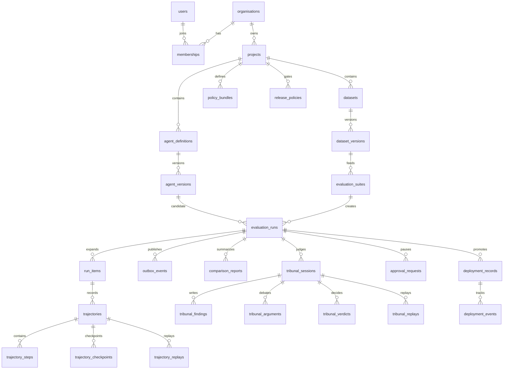

# ER diagram

## Notes

- Tenant ownership flows through `organisations` and `projects`; API reads verify tenant scope before
  returning resource details.
- Immutable evidence records use digests: agent versions, dataset versions, evaluator versions,
  prompt versions, comparison reports and replay records.
- Redis delivers work, but PostgreSQL owns state. `outbox_events` bridges that boundary.
- Tribunal state is scoped to an evaluation run; agents cannot share blackboard state across runs.
